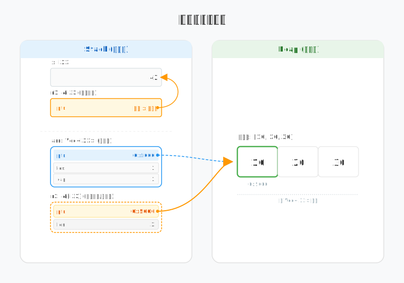
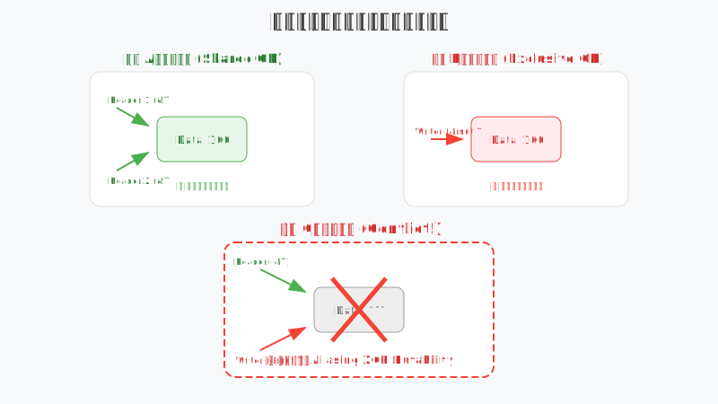

# 图解 Rust 引用：为什么 &T 只是个受限的指针？

所有权解决了内存“谁来删”的问题，但如果每次使用数据都要交出所有权（Move），开发效率将大打折扣。**引用（Reference）** 本质上是数据的“非拥有式”访问权：它在不搬运数据的前提下，通过一套“共享”与“独占”的借用规则，在底层兼顾了开发便捷性与内存安全性。本文将从**内存结构、执行机制、借用规则**以及**重借用**四个维度，深度拆解引用的技术本质。

---

## 1. 内存结构 (Memory Structure)

在底层，引用并不神秘。对于大多数类型，引用就是一个存储内存地址的**指针**。

```rust
fn main() {
    let x = 42;
    let r1 = &x;                  // 基础引用
    let arr = vec![10, 20, 30];   // 所有者 (Heap)
    let r2 = &arr[..];            // 胖指针 (切片引用)
}
```



### 基础引用 (Basic Reference)
对于普通类型（如 `i32`、结构体），其引用 `&T` 在 64 位系统上始终占据 **8 字节**。
- **字节本质**：它存储的是目标数据在栈或堆上的起始内存地址。
- **寻址逻辑**：CPU 通过该地址直接跳转到对应的内存空间。

### 胖指针 (Fat Pointer)
对于动态大小类型（DST，如 `str` 或 `[T]`），其引用（`&str` 或 `&[T]`）被称为**胖指针**，占据 **16 字节**。
- **ptr (8 字节)**：指向数据起始位置。
- **len (8 字节)**：记录元素的数量（或字节长度）。

> **Deep Insight**：Rust 将长度信息存储在引用（指针）中，而不是像 C 语言那样放在数据末尾（如 `\0`），这不仅让 `len()` 操作达到了 $O(1)$ 的效率，更从根源上杜绝了缓冲区溢出的风险。

---

## 2. 执行机制 (Execution Mechanism)

引用本身只是一个地址，要访问背后的数据，必须经过**解引用 (Dereferencing)**。

### 显式解引用
使用 `*` 操作符可以从引用回到数据：
```rust
let x = 10;
let r = &x;
assert_eq!(*r, 10); // 显式解引用
```

### 自动解引用 (Auto-deref)
为了提升开发体验，Rust 编译器在调用方法或访问成员时会自动尝试解引用。
```rust
struct Point { x: i32, y: i32 }
let p = Point { x: 1, y: 2 };
let r = &p;

// 你不需要写 (*r).x，直接 r.x 即可
println!("{}", r.x); 
```
> **字节事实**：自动解引用是由编译器在编译阶段插入的地址偏移指令，在运行期没有任何额外开销。

---

## 3. 借用规则 (Borrowing Rules)

这是 Rust 引用的灵魂。为了防止**数据竞争 (Data Race)**，借用检查器强制执行以下两条硬性规则：



1. **共享引用 (&T)**：允许多个“读者”同时存在，但禁止任何“作者”。
2. **独占引用 (&mut T)**：允许唯一一个“作者”，且禁止任何“读者”。

> **为什么不能同时存在？**
> 想象一下，如果一个线程正在通过 `&T` 读取内存，而另一个线程（或同一线程的另一段逻辑）通过 `&mut T` 修改了这段内存。读取者可能会读到“修改了一半”的非法数据，或者原本指向的内存地址在修改过程中发生了重分配（如 `Vec` 扩容），导致读取者持有悬垂指针。

---

## 4. 重借用机制 (Re-borrowing)

你可能会好奇：如果 `&mut T` 是独占的，为什么我们可以连续调用多个需要 `&mut` 的方法？

```rust
fn shrink(s: &mut String) { s.pop(); }

let mut s = String::from("Rust");
shrink(&mut s); // 第一次“借用”
shrink(&mut s); // 第二次“借用”
println!("{}", s);
```

按理说，`&mut s` 传入 `shrink` 后，所有权应该被移动。但实际上，这里发生了 **重借用 (Re-borrowing)**：
- 编译器并没有“移动”那个可变引用，而是基于原有的 `&mut` 产生了一个寿命更短的临时 `&mut`。
- 在临时借用存活期间，原有的引用会被暂时“冻结”，直到临时借用结束。

---

## 5. 总结

Rust 的引用系统是**“内存安全”与“零成本抽象”**的完美结合。它在语法上提供了指针的灵活性，在底层保留了地址跳转的高效，同时在编译期通过一套极简的规则，将所有可能的内存灾难提前拦截。

- **&T**：是只读的地址快照。
- **&mut T**：是独占的修改权限。
- **胖指针**：是自带长度的安全边界。

通过理解引用的字节本质，你将不再被借用检查器的报错所困扰，而是学会如何利用这些规则编写出高性能且确定性安全的代码。

> **创作声明**：本文技术观点及视觉图表设计由作者原创。文章利用 AI 工具辅助进行文字润色与纠错，以确保技术表述的严谨性与准确性。
