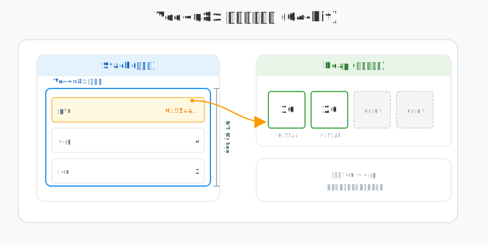
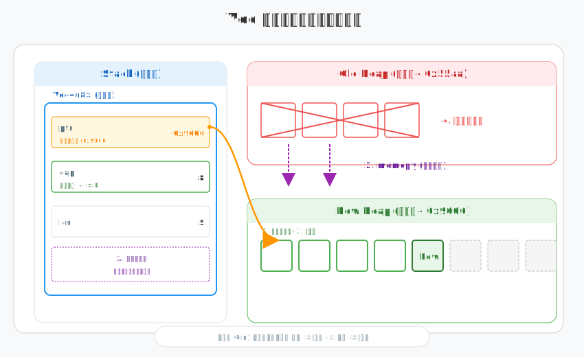
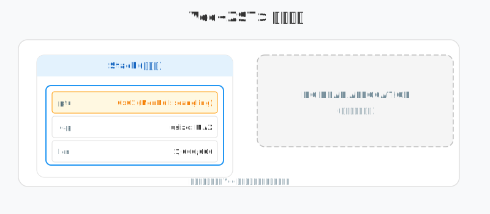
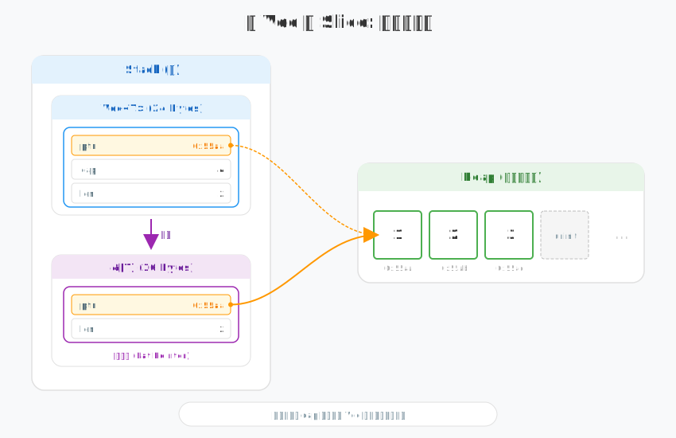

# 深度解构 Vec<T>：从 24 字节到物理重排

> 为什么一个能存储数百万个元素的 `Vec<T>`，在栈上永远只占用固定的 24 个字节？当数据量突破容量限制时，内存中究竟发生了怎样的“物理位移”？

在 Rust 的世界里，`Vec<T>` 是最常用的动态集合，但它的“动态性”背后隐藏着极其严苛的内存布局和物理逻辑。

```rust
// 核心原型：在 64 位系统下，Vec<T> 的物理结构由三个 usize 字段组成
let mut v: Vec<u8> = Vec::with_capacity(4);
v.push(10);
v.push(20);
```

## 1. 物理结构：三元组的职能

在 64 位系统下，`Vec<T>` 在**栈（Stack）**上占据连续的 **24 字节**（3 * 8 bytes），这 24 字节是管理海量数据的“司令部”：



-   **ptr (Pointer)**: 
    -   **物理本质**: 保存了堆内存分配器返回的原始起始地址。
    -   **寻址逻辑**: 所有的元素访问本质上都是基址偏移计算：`addr = ptr + index * size_of::<T>()`。
    -   **所有权**: 内部使用 `Unique<T>` 封装，向编译器声明它拥有这块内存的所有权。
-   **cap (Capacity)**: 
    -   **职能**: 标识了当前已申请堆空间的**物理上限**。
    -   **性能边界**: 只要 `len < cap`，`push` 操作仅涉及一次内存写入（memcpy）和 `len` 的自增，时间复杂度为 $O(1)$。
-   **len (Length)**: 
    -   **职能**: 划定了“已初始化”的安全区。
    -   **物理检查**: Rust 所有的索引访问都会进行边界检查（Bounds Check），即 `index < len`。越过此边界将触发 `panic`，这是防止越界访问（Buffer Overflow）的最后防线。

---

## 2. 扩容：昂贵的物理搬迁

当 `len` 试图超越 `cap` 时，`Vec` 无法在原地“膨胀”，必须触发一次**物理级的重排**：



1.  **申请新空间**: 调用分配器（Allocator）申请通常为原容量 2 倍的新内存块。
2.  **物理拷贝 (memcpy)**: 将旧地址的数据逐字节搬运至新地址。注意，这里是浅拷贝（Bitwise Copy），因为 Rust 的所有权模型保证了旧数据不会再被使用。
3.  **指针重定向**: 更新栈上的 `ptr` 为新地址，并同步更新 `cap`。
4.  **释放旧内存**: 将旧的堆空间归还给操作系统。

> **Bob 的避坑指南**: 频繁扩容会导致内存抖动和 CPU 周期浪费。如果你预先知道数据量，务必使用 `Vec::with_capacity(n)`。这不仅是性能优化，更是对内存分配器的尊重。

---

## 3. 幽灵模式：ZST (零大小类型)

如果 `T` 是一个 ZST（如 `()` 或 `struct Empty;`），`Vec` 会进入一种奇妙的“幽灵模式”：



-   **无堆分配**: 因为 `size_of::<T>()` 为 0，申请堆空间纯属浪费。
-   **ptr 的伪装**: `ptr` 会被设置为一个悬空指针 `NonNull::dangling()`（通常是 0x01）。它不指向任何实际内存，但满足“非 null”的契约。
-   **cap 的无穷大**: 对于 ZST，`cap` 实际上被视为 `usize::MAX`。你可以向里面 `push` 十亿个元素，它永远不会扩容，因为物理占用始终为 0。

---

## 4. 零成本转换：Vec vs Slice

`Vec<T>` 与切片 `&[T]` 的转换是 Rust 零成本抽象的典范：



-   **解构**: 当你调用 `v.as_slice()` 时，内核仅需从栈上拷贝 `ptr` 和 `len`。
-   **胖指针 (Fat Pointer)**: 生成一个 16 字节的结构（Pointer + Length），直接指向 `Vec` 的堆空间。
-   **物理消耗**: 整个过程仅涉及寄存器级别的数值搬运，没有任何堆分配，也没有任何内存拷贝。

## 5. So What? 工程师的直觉

理解了 `Vec` 的物理本质后，你应该具备以下直觉：
-   **慎用 `insert/remove`**: 在开头或中间插入元素会导致后续所有元素发生物理位移（memcpy），时间复杂度 $O(n)$。如果需要频繁首尾操作，考虑 `VecDeque`。
-   **利用 `truncate`**: 缩小 `len` 只是改变了栈上的一个数字，并不会释放堆内存。如果需要真正释放空间，请调用 `shrink_to_fit`。
-   **所有权转移**: 当你把 `Vec` 传给另一个函数时，仅仅是在栈上拷贝了那 24 个字节，堆上的百万数据岿然不动。这就是 Rust 高效的秘密。
