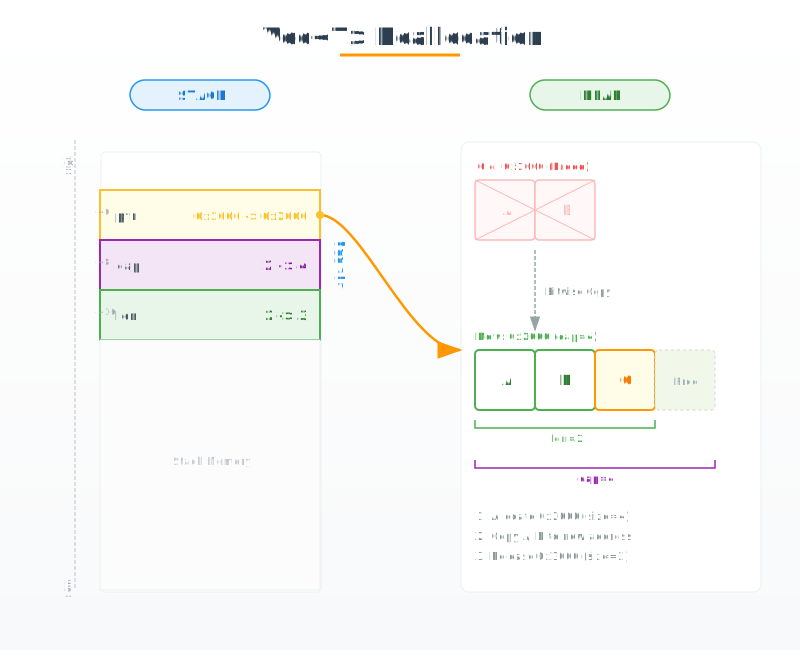
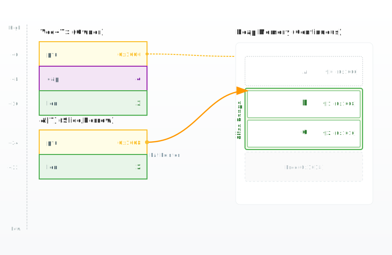
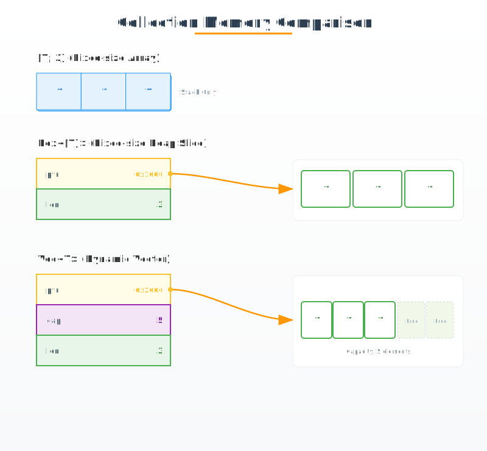

# 从内存视角理解 Vec

`Vec<T>` 是 Rust 中最常用的动态集合，但它的“动态”并不是某种黑盒魔法。在内存层面，它是一组精密的物理结构，其灵活性源于对栈与堆的协同控制。

## 24 字节：栈上的元数据控制中心

在 64 位系统下，无论 `Vec` 存储了 10 个还是 100 万个元素，它在栈（Stack）上占用的空间永远是固定的 **24 字节**。这 24 字节构成了 `Vec` 的管理核心。

```rust
let v: Vec<i32> = Vec::with_capacity(4);
// 此时栈上分配了 24 字节，指向堆内存，但尚未填入数据
```


如上图所示，这 24 字节由三个 8 字节字段组成：
- **ptr (指针)**：指向堆内存中连续空间的起始地址。
- **cap (容量)**：堆空间当前能够容纳的最大元素数量。
- **len (长度)**：当前已初始化的元素数量。

这种设计实现了生命周期与数据的分离：栈上的元数据负责边界检查与所有权管理，而堆内存则负责承载实际的数据负载。

---

## 扩容：堆内存的重新分配与按位拷贝

当 `len` 即将超过 `cap` 时，`Vec` 必须通过重新分配（Reallocation）来“搬家”。这不仅是地址的变换，更是内存状态的重构。

```rust
let mut v = Vec::with_capacity(2);
v.push('A');
v.push('B');
v.push('C'); // 触发扩容：len (3) > cap (2)
```



扩容过程在底层遵循以下严苛步骤：
1. **新空间申请**：向分配器请求一块更大的连续内存（通常容量翻倍）。
2. **Bitwise Copy**：旧内存中的数据被**按位拷贝**到新地址。由于 Rust 严格的所有权模型，这一步不涉及克隆（Clone），仅仅是物理位的移动。
3. **元数据同步**：更新栈上的 `ptr`、`cap` 和 `len`。
4. **旧空间释放**：原有的堆内存块被回收。

---

## 切片 (Slice)：轻量化的内存视图

当你不需要扩容能力，而只需要访问 `Vec` 的数据时，切片提供了更高效的零成本视图。

```rust
let v = vec!['A', 'B', 'C'];
let slice = &v[1..3]; // 获取索引 1 到 2 的切片
```



与 `Vec` 不同，切片在栈上是一个 **16 字节的胖指针（Fat Pointer）**。它剥离了 `cap` 字段，仅保留 `ptr` 和 `len`。
- 它不拥有所有权，因此无法触发扩容。
- 它的 `ptr` 可以指向堆内存的任何位置，而不仅是起始点。

---

## 权衡：Array, Box<[T]> 与 Vec 的内存策略

不同的场景需要不同的分配策略，Rust 通过内存布局的细微差异给出了不同的答案。

```rust
let arr: [i32; 3] = [1, 2, 3];         // 纯栈分配
let boxed: Box<[i32]> = vec![1, 2, 3].into_boxed_slice(); // 固定长度堆分配
let v: Vec<i32> = vec![1, 2, 3];       // 动态堆分配
```



- **`[T; N]` (数组)**：数据完全压在栈上。快，但大小必须在编译期确定，且受栈空间限制。
- **`Box<[T]>`**：固定长度的堆分配。它比 `Vec` 少了 8 字节的 `cap` 字段，适用于长度确定后不再变动的场景。
- **`Vec<T>`**：最灵活的动态形态，在栈上保留完整的 24 字节元数据以支持动态增长。

### 总结

从栈上的 24 字节出发，`Vec` 展示了 Rust 如何在物理层面统一“动态灵活性”与“内存安全性”。理解了这三个 8 字节的字段，你就掌握了 Rust 动态集合的底层真相。
