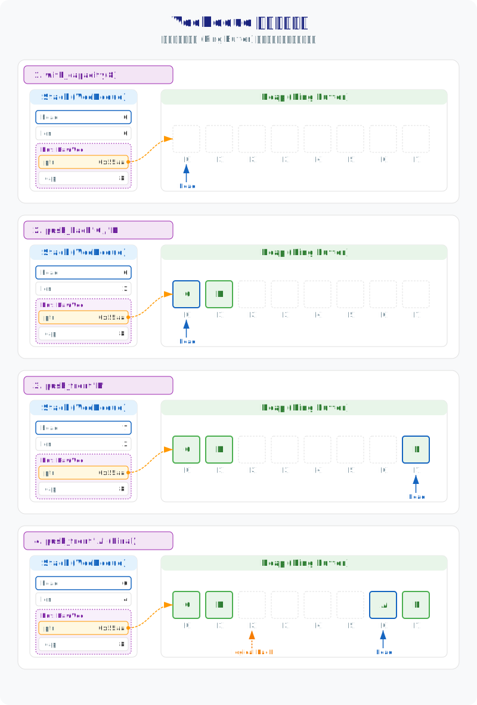

# 图解 Rust VecDeque：为什么 VecDeque 能实现 O(1) 头部插入？

在 Rust 的数据结构家族中，`Vec<T>` 是应用最广泛的基础容器，但在处理先进先出（FIFO）的任务队列或需要频繁在头部增删元素的场景下，它却存在明显的性能短板。由于 `Vec` 的逻辑索引 0 必须严格锚定在堆内存的物理起点，任何头部插入（`insert(0, ..)`）都会强迫现有元素集体向后位移（memcpy），在海量数据面前这无异于剧烈的性能下降。

`VecDeque<T>`（双端队列）正是为了解决这一局限而生的。它通过引入**漂移头部**（Floating Head）的设计，让逻辑起点可以在内存空间内自由滑动，从而将昂贵的内存搬运降级为廉价的指针偏移。

```rust
// Vec 头部插入：O(n) 开销，CPU 忙于搬运数据
vec.insert(0, item); 

// VecDeque 头部插入：均摊 O(1) 开销，仅需微小的指针偏移
deque.push_front(item);
```

*   **应用场景**：它是任务调度、双向撤销重做（Undo/Redo）以及滑动窗口等需要“两头操作”场景的首选容器。
*   **底层机制**：利用**环形缓冲区**（Circular Buffer）将逻辑序列映射到循环物理空间，通过“逻辑回绕”避免了 `Vec` 头部操作时昂贵的内存搬运（memcpy）。
*   **性能取舍**：灵活性是有代价的。由于数据在内存中可能发生“物理断裂”（被切分为两段），随机访问时需要额外的逻辑寻址转换，无法像 `Vec` 那样实现零成本的直接内存偏移。

---

## 1. 物理结构：管理“漂移头部”的 32 字节

在 64 位系统下，`VecDeque<T>` 在栈（Stack）上占据 **32 字节**。这 32 字节通过以下四个核心字段，精准地划定了堆内存环形缓冲区的边界：

```rust
// VecDeque 的内部结构简化模型
pub struct VecDeque<T> {
    buf: RawVec<T>, // 内部包含 ptr (8B) 和 cap (8B)
    head: usize,    // 队首索引 (8B)
    len: usize,     // 元素数量 (8B)
}
```

为了直观理解这些字段如何协作，我们构造一个容量为 8 的队列并进行双端操作：

```rust
use std::collections::VecDeque;

let mut dq = VecDeque::with_capacity(8);
dq.push_back('C');
dq.push_back('D');
dq.push_front('B');
dq.push_front('A'); // 此时逻辑顺序为 [A, B, C, D]
```

下图与上面代码对应的内存演变过程。我们可以清晰地看到，当执行 `push_front` 时，`head` 指针向左移动并最终触发了**逻辑回绕**（从索引 0 回到索引 7）。此时，物理内存被逻辑上切分为两段：队首部分位于缓冲区末尾（索引 6, 7），而队尾部分位于缓冲区起点（索引 0, 1）。这种设计避免了 `Vec` 在头部插入时必须进行的 `memcpy` 全量内存搬运。



### 拆开这 32 字节
这 32 字节共同定义了环形缓冲区的物理边界与逻辑状态：

*   **`buf: RawVec<T>`** (16 字节)：
    *   **`ptr`** (8 字节)：堆内存起始指针。它是整块缓冲区的“地基”。
    *   **`cap`** (8 字节)：分配的容量。**设计核心**：`VecDeque` 强制要求容量为 **2 的幂**（Power of Two），这是后续实现位运算寻址的高性能基石。
*   **`head`** (8 字节)：逻辑起点 `self[0]` 在物理空间中的索引偏移。它随着两端的增删在缓冲区内循环“漂移”。
*   **`len`** (8 字节)：当前队列中有效元素的总数。配合 `head`，即可精确锚定逻辑上的队尾位置。

很多教程在介绍队列时首选链表，但在现代 CPU 架构下，链表的指针跳转会导致严重的缓存缺失（Cache Miss）。`VecDeque` 坚持使用连续内存，通过逻辑上的环形回绕，在保持缓存友好的同时实现了双端均摊 $O(1)$。

---

## 2. 执行机制：逻辑回绕与物理“解旋”

当 `len == cap` 时，`VecDeque` 必须寻找更大的堆空间。但与 `Vec` 简单的内存拷贝不同，`VecDeque` 的数据往往是“断裂”的（Wrapped）。

```rust
let mut dq = VecDeque::with_capacity(4);
dq.push_back('C');
dq.push_back('D');
dq.push_front('B');
dq.push_front('A'); // 此时已满且回绕：head=2, 物理布局 [C, D, A, B]

// 插入第 5 个元素触发扩容：
// 1. 分配 8 字节空间
// 2. 将 [A, B] 和 [C, D] 拷贝并解旋拼接
// 3. 插入新元素 'E'，此时 head 重置为 0
dq.push_back('E'); 
```


扩容不仅仅是申请空间，更是一次**逻辑线性化**的重排过程：

1. **申请空间**: 分配原容量 2 倍的新内存（依然严格遵守 2 的幂）。
2. **物理“解旋”**:
   - **第一阶段**: 将原内存中从 `head` 到缓冲区末尾的数据（后段）拷贝到新内存的起点。
   - **第二阶段**: 将原内存中从缓冲区起点到 `head` 之前的数据（前段）接在其后。
3. **状态重置**: 将 `head` 清零，并将 `cap` 更新为新容量。

> **为什么要“解旋”？**
> 在扩容时将回绕的数据整理成连续的线性布局，虽然增加了一次复杂的拷贝逻辑，但它保证了新内存中 `head` 永远从 0 开始。这种“一次性阵痛”换取了后续寻址逻辑的持续高效。

---

## 3. 幽灵模式：ZST 场景下的零成本计数

当 `T` 是 ZST（如 `()`）时，`VecDeque` 会进入一种完全不占堆空间的“幽灵模式”：

```rust
use std::collections::VecDeque;

let mut dq: VecDeque<()> = VecDeque::with_capacity(10);
dq.push_back(());
dq.push_back(());
// 栈上依然占据 32 字节，但 cap 自动变为 usize::MAX，且不触发任何堆分配
```


- **堆分配逃逸**: 既然元素大小为 0，申请内存就是徒劳。`cap` 被直接设为 `usize::MAX`。
- **计数器本质**: 此时的 `push` 和 `pop` 仅涉及栈上 `head` 和 `len` 的数值增减。
- **零成本**: 没有任何内存读写，性能等同于一个纯粹的整数运算计数器。

---

## 4. 零成本转换：物理断裂下的双切片视图

`VecDeque` 在逻辑上提供连续的索引访问，但在物理内存中，数据可能被切分为互不相连的两块。这种“物理断裂”导致它无法像 `Vec` 那样直接解引用为切片 `&[T]`。

```rust
let mut dq = VecDeque::with_capacity(8);
dq.push_back('C');
dq.push_back('D');
dq.push_front('B');
dq.push_front('A'); 
// 场景 1：物理内存回绕 (head=6)，数据断裂为两段
let (slice_1, slice_2) = dq.as_slices(); // (&['A', 'B'], &['C', 'D'])

// 纠偏操作：通过内存搬运将数据整理为物理连续
dq.make_contiguous(); 
// 场景 2：物理布局已纠偏 (head=0)，现在拥有完整的连续切片
let (slice_full, _) = dq.as_slices();    // (&['A', 'B', 'C', 'D'], &[])
```


为了平衡性能与便利性，Rust 提供了两种访问策略：

- **as_slices (零成本访问)**:
  - **返回**: `(&[T], &[T])` 两个切片。
  - **本质**: 直接暴露物理底层的两段连续区域。这是性能最优的选择，因为它不涉及任何内存搬运。
- **make_contiguous (有损整理)**:
  - **行为**: 通过内部内存旋转（Rotation），将断裂的两段数据强行拼凑成一段物理连续的内存。
  - **代价**: 这涉及 $O(n)$ 的内存移动。如果你的 API 必须接受 `&[T]`，这是最后的补救手段。

---

## 5. 总结

`VecDeque<T>` 的本质是给 `Vec` 装上了“滑轮”。它不再死板地要求数据必须从堆内存的最开头开始存，而是通过一个可以“滑动”的 `head` 指针，让队首可以在内存空间里自由漂移。这种巧妙的环形设计，解决了 `Vec` 在头部操作时必须搬运大量数据的难题。

当数据存到内存末尾时，它会自动“绕”回开头继续存，让头部和尾部操作都变得一样快。虽然平时数据可能是断开的，但每次扩容它都会进行一次物理上的“解旋”，把数据重新排整齐，确保后续访问的高效率。无论是处理不占空间的 ZST 类型，还是在性能与便利性之间做权衡，`VecDeque` 都体现了对内存布局与数据排布状态的确定性管理。

---

> **创作声明**：本文技术观点及视觉图表设计由作者原创。文章利用 AI 工具辅助进行文字润色与纠错，以确保技术表述的严谨性与准确性。
