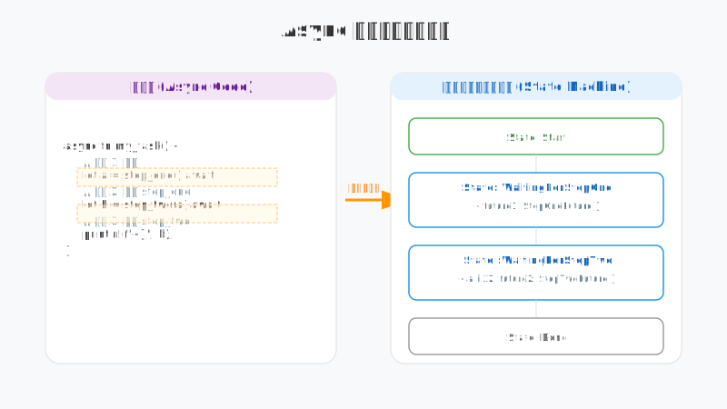

# 既然有了同步代码，为什么 Rust 还需要 async/await？——异步编程的苏格拉底式追问

你是否在写 Rust 时被 `async` 和 `.await` 搞得头大？你可能觉得它们只是为了让程序运行得更快，但如果我告诉你，它们本质上是 Rust 编译器为你写的一套极其复杂的“状态机”代工服务呢？

## 第一问：如果不使用 async，我们的程序在等什么？

想象你在写一个简单的爬虫，需要下载 100 个网页。

```rust
fn fetch_data(url: &str) -> String {
    // 假设这是一个耗时的网络请求
    let response = reqwest::blocking::get(url).unwrap();
    response.text().unwrap()
}

fn main() {
    for url in urls {
        let content = fetch_data(url); // 这里的 CPU 在干什么？
        println!("Got: {}", content.len());
    }
}
```

**那么，当 `fetch_data` 在等待网络返回时，你的 CPU 在做什么？**
它在“打瞌睡”。准确地说，线程被操作系统挂起了。为了这 100 个网页，你要么忍受极慢的串行等待，要么开启 100 个昂贵的系统线程。

**追问：我们能不能让 CPU 在等待 A 的时候，顺便把 B 的活干了，而且不需要开启成百上千的线程？**

---

## 第二问：Future 到底是个什么“饼”？

在 Rust 里，当你调用一个 `async fn` 时，它不会立即执行。它会返回一个 `Future`。

**如果说普通函数是“立即交付的汉堡”，那么 Future 是什么？**
Future 就是一张“取餐凭证”。它承诺你：*“在未来的某个时刻，如果你来问我，我会给你结果，或者告诉你我还没准备好。”*

```rust
// 简化版的 Future Trait
trait Future {
    type Output;
    // 关键点：这个 poll 方法
    fn poll(self: Pin<&mut Self>, cx: &mut Context<'_>) -> Poll<Self::Output>;
}
```

**那么，为什么我们要手动去 `poll`（轮询）它，而不是让它好了之后主动通知我们？**
这就是 Rust 异步设计的精髓：**基于拉取（Pull-based）**。
1. **节省开销**：不需要为每个任务维护复杂的回调函数链。
2. **组合性**：你可以把多个 Future 组合成一个新的 Future，而不需要嵌套回调（Callback Hell）。

---

## 第三问：.await 到底对我的代码做了什么“手脚”？

这是最神奇的地方。当你写下 `.await` 时，编译器会将你的函数拆解成一个巨大的**状态机（State Machine）**。



**如果不写 .await，代码会停下来吗？**
不会。`.await` 是一个“让出点（Yield Point）”。
1. 它检查 Future 是否就绪（Poll）。
2. 如果没好，它会把当前的执行权交还给运行时（Runtime），并记住自己现在运行到了哪一行。
3. 等下次被唤醒时，它直接从上次停下的地方继续，而不是从头开始。

> **苏格拉底的悄悄话**：你看，`.await` 并不是魔法，它只是编译器帮你把一个连贯的逻辑拆成了碎片，并存在了一个隐藏的结构体里。

---

## 第四问：谁来负责“踢” Future 一脚？

Future 本身是“懒惰”的。如果你不把它交给一个运行时（Executor），它永远不会动。

**为什么 Rust 标准库不内置一个异步运行时？**
*   **极致性能**：嵌入式系统可能只需要一个极简的单线程轮询器，而高并发服务器需要像 Tokio 这样的多线程工作窃取调度器。
*   **零成本抽象**：Rust 不想强迫你为不需要的特性（比如复杂的调度算法）买单。

---

## 终极洞察：async/await 是对复杂度的极致封装

通过这一连串的追问，我们发现 `async/await` 的本质是：
它用**同步的代码书写习惯**，掩盖了**极其复杂的非阻塞状态机**实现。

它让我们能够在不增加系统线程负担的前提下，利用 CPU 等待 IO 的空隙处理海量任务。这是一种“空间换时间”的艺术，更是编译器对开发者心智负担的终极救赎。

> **声明**：本文核心观点及每张视觉图表的设计均由作者原创构思，文章内容经由 AI 辅助润色与纠错。既然工具能帮我们将思考表达得更精准，那便没必要在文字修辞上自欺欺人，让创作回归本质才是最重要的。
