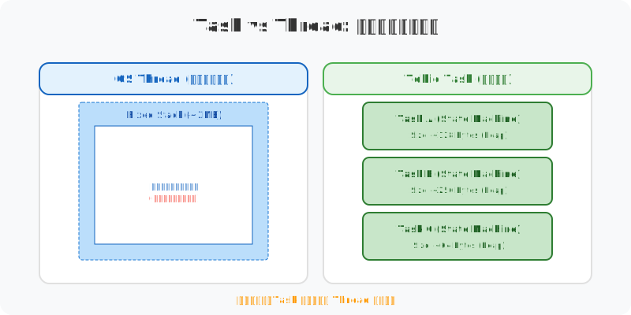

# 既然有了多线程，为什么 Rust 还需要 Tokio？——异步运行时的苏格拉底式追问

你是否曾经疑惑过：既然现代操作系统已经提供了强大的多线程支持，为什么 Rust 还要大费周章地引入 `async/await` 和像 Tokio 这样的异步运行时？

## 第一问：如果我们只用系统线程，会发生什么？

假设我们要处理 10,000 个并发的 TCP 连接。最直观的想法是：一个连接开一个线程。

```rust
// 伪代码：传统的线程模型
for stream in listener.incoming() {
    thread::spawn(move || {
        handle_client(stream); // 阻塞等待 IO
    });
}
```

**那么，这种做法的代价是什么？**
1.  **内存开销**：每个线程通常需要 2MB 的栈空间。10,000 个线程就是 20GB 内存。你的服务器吃得消吗？
2.  **上下文切换**：当 CPU 从一个线程切换到另一个线程时，需要保存寄存器、刷新缓存。10,000 个线程频繁切换，CPU 还有多少时间在做有用功？

---

## 第二问：既然线程太重，能不能把任务“切碎”？

如果我们不能给每个连接一个线程，那能不能让一个线程同时管很多个连接？

**这引出了 Tokio 的核心：Task（任务）。**

在 Tokio 里，你不再 `thread::spawn`，而是 `tokio::spawn`。

```rust
tokio::spawn(async {
    let result = do_something().await;
    println!("结果: {:?}", result);
});
```

**那么，Task 和 Thread 的物理区别到底在哪？**
Task 本质上是一个分配在堆上的状态机。它不预分配庞大的栈空间，只占用几十到几百个字节来存放它目前运行到了哪一步。



> **苏格拉底的悄悄话**：你可以把线程想象成一辆巨大的巴士（重但稳），而把 Task 想象成巴士上的乘客。Tokio 就是那个调度员，决定哪辆巴士现在该载哪些乘客走一段路。

---

## 第三问：如果 Task 停下来等 IO 了，线程在干什么？

当你在代码里写下 `.await` 时，Task 可能会因为等待网络数据而挂起。

**这时候，背后的 Worker 线程会坐着干等吗？**
绝对不会。这就是 **Work-Stealing（工作窃取）** 调度算法介入的时候。

1.  **Worker A** 的任务挂起了。
2.  **Worker A** 立即看向自己的本地队列：还有其他活吗？
3.  如果本地没活了，它会看向 **Worker B**：兄弟，你那儿任务太多了，分我一半！

**那么，这种“窃取”是如何保证公平和效率的？**
它避免了 CPU 核心的闲置。通过在用户态完成这种任务交换，我们避开了昂贵的内核上下文切换。

---

## 第四问：如果我不小心在 Task 里写了个死循环，会怎样？

这是一个非常经典的问题。异步是“协作式”的。

**如果一个 Task 永远不执行 `.await`，它会发生什么？**
它会“绑架”它所在的 Worker 线程。因为没有 `.await`（也就是没有让出点），调度器无法强行把这个 Task 踢下去。

*   **后果**：该线程上的其他 Task 全部饿死。
*   **追问**：那我们该怎么办？
*   **答案**：永远不要在异步函数里执行长时间的同步阻塞操作。如果有，请交给 `tokio::task::spawn_blocking`。

---

## 终极洞察：异步的本质是“权衡的艺术”

通过这一连串的追问，我们发现 Tokio 并不是什么魔法。

它通过**堆上的状态机**解决了内存压力，通过**用户态调度**解决了切换开销，但也带来了**协作式编程**的心智负担（你必须时刻注意不要阻塞线程）。

Rust 并没有给你一个完美的银弹，它只是给了你一套工具，让你能以极低的物理代价，构建出支撑百万并发的逻辑帝国。

> **声明**：本文核心观点及每张视觉图表的设计均由作者原创构思，文章内容经由 AI 辅助润色与纠错。既然工具能帮我们将思考表达得更精准，那便没必要在文字修辞上自欺欺人，让创作回归本质才是最重要的。
