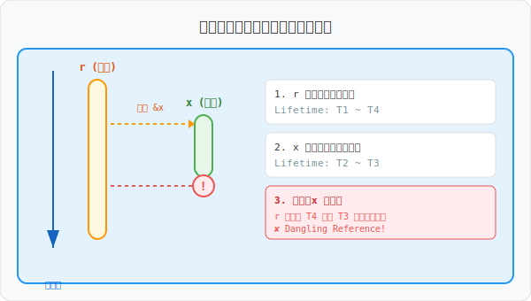

# 图解 Rust：生命周期 (Lifetimes)

生命周期是 Rust 内存安全的核心支柱之一，它的任务只有一个：**确保所有引用永远有效**。

## 1. 痛点：悬垂引用 (Dangling References)

如果没有生命周期检查，程序可能会尝试访问已经释放的内存，导致未定义行为。



- **过程**：
  1. 在外部作用域声明引用 `r`。
  2. 在内部作用域创建数据 `x` 并让 `r` 引用它。
  3. 内部作用域结束，`x` 被销毁（Drop）。
  4. 外部作用域尝试通过 `r` 访问 `x`，导致崩溃（如果编译器不拦截）。
- **Rust 的解决方式**：借用检查器在步骤 2 就会报错，因为它预见到 `x` 的寿命短于 `r`。

## 2. 核心机制：借用检查器 (Borrow Checker)

编译器通过比较变量的 **作用域范围** 来判断引用是否合法。


- **'a (数据)**：被引用数据的实际存活周期（父集）。
- **'b (引用)**：引用变量本身的存活周期（子集）。
- **金律**：引用的生命周期必须被包含在数据的生命周期之内，即 `'b ⊆ 'a`。

## 3. 函数签名中的生命周期

当函数涉及多个引用且返回引用时，编译器需要明确它们之间的关联。


### 理解“路径流转”：漏斗模型
很多初学者对“流转”感到困惑，我们可以通过下面这个**漏斗模型**来直观演示：


1.  **输入阶段**：函数接收多个引用（如 `x` 和 `y`），它们各自有不同的“寿命长度”。
2.  **漏斗筛选（'a）**：泛型标签 `'a` 就像一个漏斗。当你把 `x` 和 `y` 都标记为 `'a` 时，漏斗会自动收缩到**最窄的那一个输入**的宽度。
3.  **流转结果**：返回值的生命周期标签也是 `'a`，这意味着它必须通过这个漏斗。
4.  **最终约束**：即使你返回的是长寿命的 `x`，它的“身份证”也会被漏斗强制盖上短寿命的戳。

**总结**：流转不是数据的流动，而是**生命周期约束（Validity Constraint）的传递路径**。它确保了返回的引用永远不会比任何一个潜在的源头活得更久。

## 4. 结构体中的生命周期
当结构体持有引用时，必须显式标注生命周期。这相当于向编译器做出一项**契约保证**：结构体本身的寿命绝对不会超过它所持有的引用的寿命。

- **意义**：防止结构体在数据销毁后继续存在，从而避免崩溃。

### 思考：如果不标注会发生什么？
生命周期标注不是为了满足编译器的“怪癖”，而是为了**静态拦截**潜在的内存灾难。我们可以从“表象”与“本质”两个维度来理解：

- **表象：编译器直接拒绝 (Compilation Failure)**
  当代码不符合自动推断规则时，编译器会报出 `missing lifetime specifier`。Rust 宁愿拒绝一段可能正确的代码，也绝不允许任何一段可能导致崩溃的代码进入运行期。

- **本质：规避内存灾难 (Memory Corruption)**
  编译器之所以“胆小”，是因为它必须阻止**悬垂指针 (Dangling Pointer)** 的产生。

  **错误示例（Rust 会在编译阶段拦截）：**
  ```rust
  // ❌ 编译器报错：`x` does not live long enough
  let r;
  {
      let x = 5;
      r = &x; // 借用检查器：发现 x 的寿命短于引用者 r
  }
  println!("{}", r); // 如果通过编译，此处将访问已释放的栈空间 -> 崩溃
  ```
  在 C/C++ 中，上述逻辑能顺利编译通过，但会在运行时产生难以调试的随机崩溃或安全漏洞。**生命周期标注的本质，就是将这种运行时的不确定性，转化为编译时的确定性。**

## 5. 深度：从内存布局看生命周期的本质

剥开语法糖，生命周期在底层是编译器对 **内存地址有效性 (Memory Address Validity)** 的一套静态跟踪算法。


### 核心逻辑链条：
1.  **符号化的“有效期存根”**：
    在栈内存中，引用（如 `&str`）在机器码层面只是一个普通的指针（包含地址和长度）。但对于编译器，它在符号表中为该指针关联了一个虚拟标签 `'a`。这个标签记录了该指针被允许解引用的**最大合法时空边界**。

2.  **所有权引发的“地址失效”**：
    当一个变量（所有者）离开作用域时，它所控制的内存地址（无论是栈上的 Frame 还是堆上的 Data）在借用检查器的视图中会被立即标记为 **Tombstone（墓碑/失效状态）**。

3.  **静态时空的交集校验**：
    借用检查器的核心任务，就是扫描代码中所有对该地址的解引用操作。它会对比指针关联的 `'a` 标签与目标地址的有效区间。
    - **合法**：指针的 `'a` 边界完全落在地址失效之前。
    - **冲突**：指针的 `'a` 标签显示它在地址失效后仍可能被解引用。

### 结论：
生命周期是 Rust 将“动态的内存访问行为”映射为“静态的符号约束”的神来之笔。它让引用在运行时保持了与 C 指针一致的零成本性能，却在编译阶段通过这套“存根校验机制”彻底消灭了悬垂指针。

## 6. 代码点睛：为什么这里必须显式标注？

在下面的 `longest` 函数中，显式标注 `'a` 是不可或缺的：

```rust
fn longest<'a>(x: &'a str, y: &'a str) -> &'a str {
    if x.len() > y.len() {
        x
    } else {
        y
    }
}
```

### **解析：编译器的“选择困难症”**

1.  **多源头歧义**：
    该函数接收两个引用 `x` 和 `y`，并返回其中一个. 编译器在**编译阶段**并不知道运行时到底会返回 `x` 还是 `y`。

2.  **生命周期消除规则的失效**：
    Rust 有一套自动推断规则（Elision Rules），但它只适用于“单输入引用”或“特定的 self 情况”。对于 `longest` 这种多输入引用的情况，编译器无法自动判断返回值的生命周期应该挂钩到 `x` 还是 `y`。

3.  **显式标注的作用**：
    通过标注 `<'a>`，你实际上是在告诉编译器：
    - “返回值引用的生命周期，将与 `x` 和 `y` 中**寿命较短**的那一个保持一致。”
    - 这建立了一个**通用的契约**。调用方在使用该函数时，借用检查器会根据这个契约来验证返回值的引用是否超出了任何一个潜在源头的作用域。

**如果没有这个标注，编译器将无法在调用点（Call Site）安全地检查返回引用的有效性，因此会直接拒绝编译。**

```rust

fn main() {
    let string1 = String::from("long string is long");
    let result;
    {
        let string2 = String::from("xyz");
        // result 的生命周期被 string2 限制
        result = longest(string1.as_str(), string2.as_str());
        println!("最长的是: {}", result);
    } 
    // println!("{}", result); // ✘ 这里会报错，因为 string2 已销毁
}
```

## 一句话总结

**生命周期标注不是为了延长变量的寿命，而是为了向编译器保证引用的有效性，从而换取运行时的零成本安全。**
