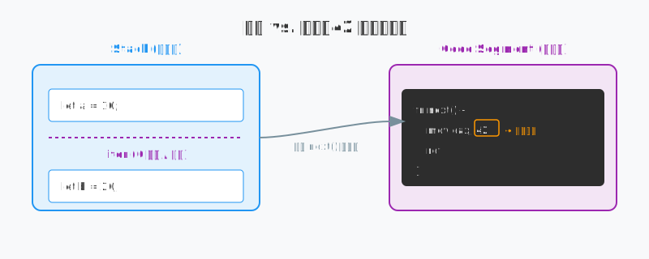
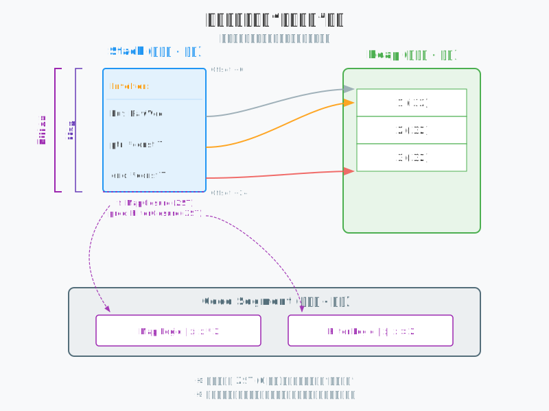
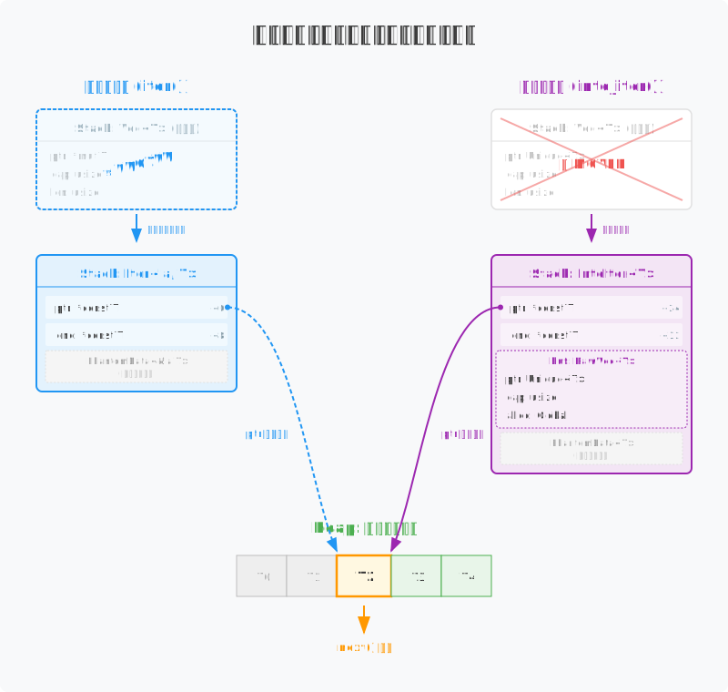

# Rust 迭代器： 数据处理的流水线

在很多编程语言中，迭代器只是遍历集合的工具。但在 Rust 里，迭代器（Iterator）的本质是一套**延迟执行的处理逻辑**。

当你调用 `.map()` 或 `.filter()` 时，内存里并没有产生新的集合，也没有立即触发计算。你实际上是在构建一个嵌套的结构体，像叠罗汉一样把处理规则一层层包裹起来。只有当你调用 `.collect()` 或 `for` 循环时，这台“抽水机”才开始工作，数据才会真正流动。

这种设计的优势在于：编译器能看穿这些嵌套的结构，并把它们合并成一个紧凑的循环。这意味着你可以写出像脚本语言一样优雅的链式代码，同时获得接近 C 语言手写循环的运行效率。

---

## 1. 零成本抽象

在 Rust 中，迭代器不直接存储数据，它更像是一张**数据处理的“蓝图”**。


有些迭代器在运行时**完全不占空间**。这听起来违背直觉，但逻辑其实很直接。想象一个永远只返回数字 `42` 的迭代器。它不需要计数器，也不需要指针，它唯一的“状态”就是它的逻辑。既然没什么好记录的，它在内存中就是零大小（ZST）。

```rust
struct AlwaysFortyTwo;

impl Iterator for AlwaysFortyTwo {
    type Item = i32;
    fn next(&mut self) -> Option<Self::Item> { Some(42) }
}

fn main() {
    let a = 10i32;
    let mut iter = AlwaysFortyTwo; // 定义了它，但它不占空间
    let b = 20i32;
}
```



在左边的“栈内存”中，变量 `a` 和 `b` 的地址是完全连续的，虽然中间定义了 `iter`，但它没有让栈指针挪动哪怕 1 个字节。与此同时，在右边的“代码段”里，`next` 函数的行为被编译器直接固化成了 CPU 指令。这意味着调用 `next()` 时，CPU 会直接执行逻辑，不需要去内存里查找任何状态。这就是 Rust 的魔法：逻辑在源码里清晰可见，但在内存里物理隐身。


当你连续调用 `.map()` 或 `.filter()` 时，代码看起来是在一层层转换数据，但内存里并没有发生多次拷贝。你只是在给最底层的原始迭代器套上一层又一层的“面具”。在 Rust 中，这种嵌套是**逻辑上的套娃，物理上的扁平**。每一个组合子都会生成一个新的包装类型，但因为内存布局优化，它们往往共享同一个起始地址。

```rust
let iter = vec![1, 2, 3]
    .into_iter()
    .map(|x| x * 2)
    .filter(|x| x > 2);
```




在栈内存中，`Filter`、`Map` 和 `IntoIter` 共享同一个起始地址，这种 **Offset 0** 的布局意味着无论你套了多少层组合子，物理上它们都挤在同一个内存块里，没有多余的指针跳转。图中虚线标注的闭包字段物理上不占空间，它们更像是给编译器看的“逻辑门牌”，指引 CPU 去代码段执行对应的逻辑。整条流水线的动力源泉其实只有最核心的 `IntoIter` 里的三个指针（`buf`, `ptr`, `end`），它们负责在堆内存上划定范围，而剩下的 `Map` 和 `Filter` 只是在数据流过时顺便执行一下代码。

---

## 2. 借用 vs 所有权

迭代器如何处理底层数据，直接决定了它在栈上的胖瘦。在 Rust 中，最常见的两种遍历模式分别是“只读借用”和“夺取所有权”。

```rust
let v = vec![1, 2, 3];

let iter = v.iter();           // 借用模式：只是看看
let into_iter = v.into_iter();   // 所有权模式：彻底拥有
```



迭代器如何处理数据，直接决定了它在栈上的“胖瘦”。在**借用模式**下，迭代器非常苗条，仅需在栈上保存 `ptr`（当前位置）和 `end`（结束位置）两个指针。它像是一个临时的观察者，在迭代期间会将原集合 `v` 冻结（Frozen），确保数据在遍历过程中不会被意外修改，从而避免指针失效。

而一旦切换到**所有权模式**，迭代器就会接管 `Vec` 的堆所有权，在栈上变得“胖”起来，因为它需要存储完整的 `RawVec` 结构（包含指针、容量等）。此时，原变量 `v` 会直接消失（Moved），迭代器成为了数据的新主人，并全权负责在遍历结束时打扫战场，释放堆内存。

---

## 3. for 循环脱糖

如果你觉得 `for` 循环是某种底层结构，那就错了。在 Rust 里，所有的 `for` 循环在编译时都会被“脱糖”成最原始的 `loop` 和 `match`。

不同于某些语言由数据源主动往外推数据的做法，Rust 的迭代器是**被动拉取（Pull）**的。迭代器本身就在那儿静静地躺着，只有当你喊一声 `next()`，它才会动一下，吐出一个值。

```rust
// 你写的代码
for item in collection { ... }

// 编译器“脱糖”后的样子
let mut iter = collection.into_iter(); // 1. 先把集合转成迭代器
loop {
    match iter.next() {               // 2. 像抽水泵一样抽一个值出来
        Some(item) => { ... },        // 3. 有值就干活
        None => break,                // 4. 没值了就停工
    }
}
```

我们可以将迭代器看作一根水管，而 `for` 循环就是末端的“抽水泵”。这种被动拉取的模式确保了逻辑的惰性执行：如果不抽水（调用 `next()`），水管中嵌套的 `map` 或 `filter` 逻辑就永远不会运行。

为了给这台抽水泵提供安全护航，`into_iter()` 会在循环开始时接管数据的所有权。这种所有权的转移保证了数据源在遍历期间是绝对稳定的，从根本上杜绝了“一边遍历一边修改”导致的并发风险。更妙的是，由于迭代器在底层精确掌握了起点（`ptr`）和终点（`end`），编译器在生成机器码时往往能直接省去边界检查（Bounds Check），这使得迭代器的执行效率通常优于手写的 `while i < len` 循环。

---

## 5. 总结

Rust 迭代器的设计体现了它的核心哲学：**逻辑上高度抽象，物理上极其透明**。

你写代码时，关注的是处理逻辑——怎么过滤、怎么转换，写出来的代码像脚本语言一样易读。但到了编译器手里，这些高级抽象会被层层剥开，最后变成一段没有任何废动作的机器码。
